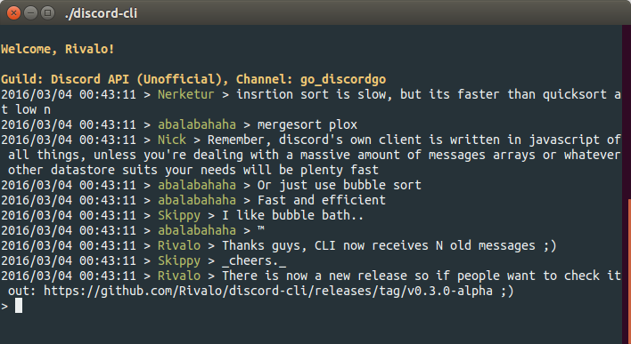

# discord-cli
Minimalistic Command-Line Interface for Discord

Disclaimer: Currently only tested on Linux.
 It also looks pretty bad in its current state.
### How to Install?
Currently the easiest working way to install is to use the Go tools. I'm looking at using GCCGO and makefiles to reduce installation steps, and make setting PATHS unnecessary.
* Install the Go Tools and setup the `$GOPATH` (There are loads of tutorial for this part)
* `$ go get -u github.com/Rivalo/discord-cli`
* Go to the `bin` folder inside your `$GOPATH`
* `./discord-cli`

### Current Configuration Settings
Configuration files are being stored in JSON format and are automatically created when you first run discord-cli. Do not change the 'key' value inside `{"key":"value"}`, this is the part that discord-cli uses for parsing, missing keys will definitely return errors.

| Setting       | Function         |
| ------------- |-------------|
| username      | Discord Username (emailaddress) |
| password      | Discord Password |
| guild         | Default Discord Server (Currently `null` because this function does not work yet) |
| channel       | Default Discord Text Channel (Currently `null` because this function does not work yet) |

### Chat Commands
When inside a text channel, the following commands are available:

| Command       | Function         |
| ------------- |:-------------:|
| :q      | Quits discord-cli |
| :d      | 'Disconnect' Guild and go back to selection menu|
| :c      | Change listening Channel inside Guild
